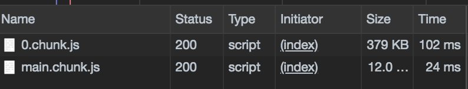
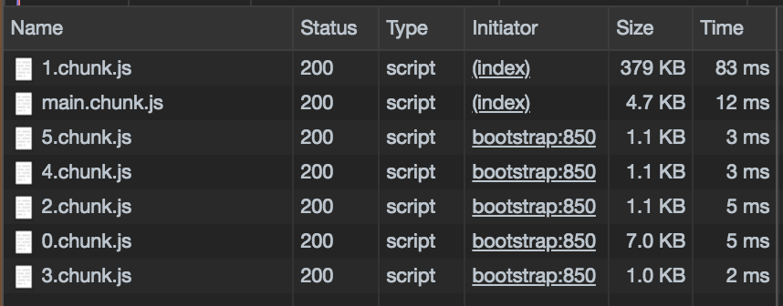

# Thanksgiving Dinner

## A React Suspense and lazy() demo

### Why bother

Code-splitting creates a better UX *and* better ROI by reducing bounce rates of your customers. It's also the right thing to do: your users likely do not have unlimited data (particularly on mobile) and definitely do not have unlimited time.

### Walkthrough

#### 1. initial commit

At this stage, we're loading images on the client-side without handling loading states. The only webpack chunks in the network tab of Chrome DevTools are the ones that come by default with create-react-app. The experience is jumpy and slow for the user.

#### 2. add some loading spinners

We haven't done anything to lazyload yet...

#### 3. break this up into "courses" for the user

The user doesn't want to see everything all at once! In this step we implemented buttons that only show one course at a time.

Unfortunately, even though it appears that the components aren't loading until the user clicks the button to get their next course, the same bundles are still loading at the same time!

#### 4. implement React Suspense and React.lazy 👏🏾

Now our app is split into multiple smaller chunks based on our desired courses. We don't make the network call for those assets until the user requests it.

Note that this is actually, in many ways, a worse user experience for an app this small. Good thing this is just for practice!

#### 5. Next steps for this app

Next steps could include server-side rendering the initial view for faster initial loads or search engine optimization. One could also preload data using React.lazy(). We would also be wise to include error handling in case our (albeit fake) fetch.

#### 6. Next steps for Suspense

The React team has repeatedly stated that, although code-splitting is the only *current* use case for React.Suspense, they are working on expanding it to handle data fetching and integrating it with libraries like Apollo.

### Tips

- there are important bug fixes in 16.6.3, so make sure you're on that version of React
- Lazy [only works with default imports](https://twitter.com/vincentriemer/status/1064198378333052928)
- Doesn’t work for server-side rendering yet, use [react-loadable](https://github.com/jamiebuilds/react-loadable) for now
- Only use lazy-loading for bigger chunks of code, otherwise it could actually slow down your application
- Regarding Suspense as a whole, it’s only ready for code splitting right now. The cache and whatnot is super fun, but don’t use it yet, or [Dan will be sad](https://twitter.com/dan_abramov/status/1055294178001862658)

### More resources

#### Official stuff

- [Reactjs.org Code-Splitting](https://reactjs.org/docs/code-splitting.html#reactlazy)
- [React 16 Roadmap](https://reactjs.org/blog/2018/11/27/react-16-roadmap.html)
- [React.lazy RFC](https://github.com/reactjs/rfcs/pull/64)

#### Tools

- [Hitchcock: debugging tool for Suspense](https://github.com/pomber/hitchcock)

#### Videos

- [Moving To React Suspense - Jared Palmer - React Conf 2018](https://www.youtube.com/watch?v=SCQgE4mTnjU)
- [React 16.6 - What's New? Theory + Practice](https://youtu.be/BnasObkCGtQ?t=944)
- [Use React.lazy and Suspense to Code-Split Your App by Harry Wolff](https://youtu.be/SGSAPfjOHBM)
- [Suspense!](https://www.youtube.com/watch?v=6g3g0Q_XVb4&t)
- [Concurrent Rendering in React - Andrew Clark and Brian Vaughn - React Conf 2018](https://www.youtube.com/watch?v=ByBPyMBTzM0)
- [Learn React lazy, memo, useState and useEffect in 7 minutes](https://egghead.io/playlists/learn-react-lazy-memo-usestate-and-useeffect-in-7-minutes-fc805899?fbclid=IwAR1jEixfUUcu8B4uVYD2DiRImguBwhsS4L0-MPV47Y-F_JpJzt3R5lKIYMQ)

#### Articles

- [Lazy loading (and preloading) components in React 16.6 by Rodrigo Pombo](https://medium.com/@pomber/lazy-loading-and-preloading-components-in-react-16-6-804de091c82d)
- [Fast as never before. Code-splitting with React Suspense, lazy + Router + Redux + Webpack 4](https://medium.com/@svyat770/fast-as-never-before-code-splitting-with-react-suspense-lazy-router-redux-webpack-4-d55a95970d11)
- [How to retry when React lazy fails by Guilherme Oenning](https://goenning.net/2018/11/16/how-to-retry-dynamic-import-with-react-lazy/)
- [Dramatically Speed Up Your React Front-End App Using Lazy Loading by Luke Jones](https://code.tutsplus.com/tutorials/dramatically-speed-up-your-frontend-application-using-react-loadable--cms-32107)
- [How to use React.lazy and Suspense for components lazy loading](https://medium.freecodecamp.org/how-to-use-react-lazy-and-suspense-for-components-lazy-loading-8d420ecac58)
- [Our very own Sung Kim's Loading React Components Dynamically on Demand Using React.lazy](https://www.slightedgecoder.com/2018/10/28/loading-react-components-dynamically-on-demand-using-react-lazy/)
- [Add a touch of Suspense to your web app with React.lazy()](https://codeburst.io/add-a-touch-of-suspense-to-your-web-app-with-react-lazy-374e66ee05af)
- [How to use React suspense and React.lazy](https://dev.to/saigowthamr/how-to-use-react-suspense-and-reactlazy--klg)

### Thanks

- [Rhys Lloyd](https://codepen.io/justrhysism/pen/eDJrk) for the background plate
- photographers for the images (see alt text and source links for details)
- the React core team and all the people who have created educational tools for us to learn these tools
- ReactNYC and you!
